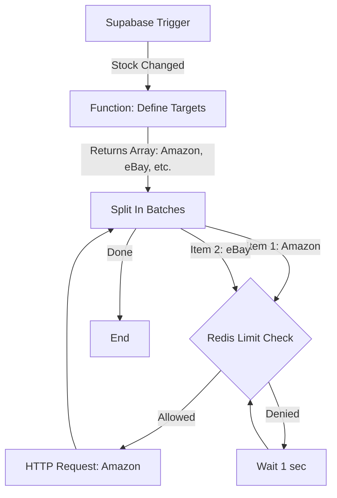

# ShopiAuto n8n Workflow Implementation Guide

This guide details how to reconstruct the 4 critical workflows described in the Phase 2 Technical Report.

## 1. Setup Redis Connection
Since we are using "Queue Mode", we need to ensure n8n can talk to Redis.
1. In n8n, go to **Credentials**.
2. Create new **Redis** credential.
3. Host: `redis` (if using docker-compose), Port: `6379`.

## 2. Workflow: Order Ingest (Webhook -> Redis)
**Goal:** Receive Shopify Webhook and push to Queue immediately (Active Producer).

### Nodes:
1. **Webhook Node** (Trigger)
   - Method: POST
   - Path: `orders/create`
   - Authentication: Header Auth (Verify HMAC if possible, or do it in the next step)
2. **Crypto Node** (Optional)
   - Function: HMAC Verification of `X-Shopify-Hmac-Sha256`.
3. **Redis Node**
   - Operation: `LPUSH` (List Push)
   - Key: `job_queue_orders`
   - Value: 
     ```json
     {
       "shop_domain": "{{ $json.headers['x-shopify-shop-domain'] }}",
       "payload": {{ JSON.stringify($json.body) }}
     }
     ```
   - **Crucial**: We wrap the order data with the `shop_domain` so the Worker knows which execution context (Tenant) this belongs to.

## 3. Workflow: Order Processor (Redis -> DB)
**Goal:** Process the queue and perform Atomic Reservation.

### Nodes:
1. **Cron Node** (Trigger)
   - Interval: Every 1 minute (or use a specialized Trigger if using n8n Queue Mode native features).
   - *Better Approach*: Use n8n's "On RabbitMQ Message" if using RabbitMQ, but for Redis, we might loop.
   - *Best Approach for High Scale*: This workflow runs on **Worker Nodes**. It loops infinitely or checks frequently.
   - Key: `job_queue_orders`
   - Timeout: 0 (block indefinitely until job comes).
   - *Output*: You will receive the `{ "shop_domain": "...", "payload": {...} }` object.
3. **Supabase Node (Get Credentials)**
   - **Goal**: We need the API Token and Shop ID to process this order.
   - Operation: **Get a Row**
   - Table: `shops`
   - Column to filter by: `shop_domain`
   - Value: `{{ $json.shop_domain }}`
   - *Result*: Now the workflow has `id` (shop_id) and `access_token`.
4. **Postgres Node** (Supabase)
   - Operation: **Execute Query**
   - Query: 
     ```sql
     select reserve_inventory(
       $1, -- SKU
       $2, -- Location ID
       $3, -- Market ISO
       $4, -- Quantity
       $5, -- Reference ID (Order ID)
       $6,  -- Trace ID
       $7   -- Shop ID (Multi-Tenancy)
     );
     ```
   - Parameters: Map fields from `$json.payload` and `$node["Supabase Node"].json.id`.
4. **If Node** (Switch)
   - Condition: `{{ $json.reserve_inventory }}` is `true`.
   - **True Path**: Log success, maybe notify Discord/Slack.
   - **False Path**: Trigger "Order Cancellation" API call to Shopify (Overselling prevented!).

## 4. Workflow: Multi-Channel Sync (Fan-Out)
**Goal:** When Stock changes, push to Amazon, eBay, etc.

Since one stock change needs to go to multiple places, we use a "Loop" pattern.



### Nodes Logic:

1. **Supabase Trigger Node** (Realtime)
   - Event: `INSERT` or `UPDATE` on `inventory_levels`.
   - Result: Gets the new stock count.

2. **Function Node** (Fan-Out Logic)
   - *Logic*: Convert the single DB row into a list of targets.
   - Javascript Code:
     ```javascript
     // Example: sync to Amazon and eBay
     return [
       { json: { market: 'amazon', endpoint: 'https://amazon...', payload: { ... } } },
       { json: { market: 'tiktok', endpoint: 'https://tiktok...', payload: { ... } } }
     ];
     ```

3. **Split In Batches** (The Loop Starter)
   - Batch Size: `1`
   - *Logic*: This node takes the array of 2 items (Amazon, TikTok) and releases them **one by one**.
   - Input: Array of 2.
   - Output (1st run): Amazon Item.

4. **Redis Node** (Rate Limit Check)
   - *Why inside the loop?* Because Amazon might have a limit of 10 req/sec, but TikTok has 50. We need to check limits **per target**.
   - Execute Lua Script.

5. **HTTP Request Node**
   - Sends the update to the current item's endpoint (Amazon or TikTok).

6. **Loop Back**:
   - Connect the output of the HTTP Request (or Error node) **back to the input of "Split In Batches"**.
   - This tells n8n: "I'm done with Item 1, give me Item 2."

## 5. Circuit Breaker Logic
Wrap the `HTTP Request Node` in a **Try/Catch** (Error Trigger).
- **On Error**: Increment a Redis Key `error_count:amazon`.
- **Before Request**: Check Redis Key. If `error_count > 10`, skip request (Circuit Open).

## 6. SaaS Pattern: Dynamic Credential Lookup
Since this is a SaaS application, you cannot hardcode API Credentials in the HTTP Request node. You must fetch them dynamically based on the incoming webhook.

### Database Change
Run `0005_saas_tenancy.sql` to create the `shops` table.

### Workflow Logic
1. **Webhook Trigger**: Receives `X-Shopify-Shop-Domain: example.myshopify.com` header.
2. **Supabase Node (Get Token)**:
   - Operation: **Get Many** (or Exec SQL)
   - Table: `shops`
   - Filter: `shop_domain` = `{{ $json.headers['x-shopify-shop-domain'] }}`
3. **Set Node**:
   - Save `access_token` into a workflow variable.
4. **HTTP Request Node**:
   - Header `X-Shopify-Access-Token`: `{{ $node["Supabase Node"].json.access_token }}`
   - Header `X-Shopify-Access-Token`: `{{ $node["Supabase Node"].json.access_token }}`
   - URL: `https://{{ $node["Supabase Node"].json.shop_domain }}/admin/api/2024-01/orders/...`

## 7. Multi-Channel Ingest Patterns (The "Hub" Strategy)
To support a Standalone SaaS model, we need to ingest orders from ALL platforms, not just Shopify.

### A. Unified Redis Payload
Regardless of the source (Amazon, eBay), the payload pushed to Redis must be **normalized** so the Processor can understand it.

```json
{
  "shop_id": "UUID-FROM-DB",
  "source": "amazon",
  "payload": { ...original_platform_json... }
}
```

### B. Amazon Ingest Workflow (Poller)
Amazon SQS is complex. For MVP, use a **Schedule Trigger** (Every 5 mins).
1. **Schedule Trigger**: 5 Minutes.
2. **Supabase Node**: Fetch all shops with `amazon_connected = true`.
3. **Split In Batches**: Loop through each shop.
4. **HTTP Request**: Call Amazon SP-API `GET /orders` (createdAfter = last_sync).
5. **Redis Node**: Push new orders to `job_queue_orders`.

### C. eBay Ingest Workflow (Notification)
eBay supports **Marketplace Account Deletion/Notification** webhooks.
1. **Webhook Node**: Receives eBay XML/JSON notification.
2. **Redis Node**: Push to `job_queue_orders`.

## 8. Testing Without Shopify (Simulation)

If you don't have a live Shopify store yet, you can simulate incoming orders to test your Architecture (n8n -> Redis -> DB -> Frontend).

### Method A: n8n Manual Trigger
1. In your **Order Ingest Workflow**, replace the **Webhook Node** temporarily with a **Manual Trigger Node**.
2. Add a **Edit Fields (Set)** node immediately after it.
3. Paste the content of `n8n/sample_shopify_order.json` into the JSON parameter.
4. Run the workflow manually. You should see the data flow to Redis and then to Supabase.

### Method B: HTTP Request (Simulation via Curl)
Keep the **Webhook Node** active. Open your terminal and send a fake request:

```bash
curl -X POST http://[YOUR-VPS-IP]:5678/webhook/orders/create \
-H "Content-Type: application/json" \
-d @n8n/sample_shopify_order.json
```

### Method C: The "Load Generator" Workflow
Create a separate n8n workflow that runs every 5 seconds and sends random HTTP POST requests to your main Ingest Webhook. This simulates a "Black Friday" traffic spike to test your Rate Limiting and Queueing.

